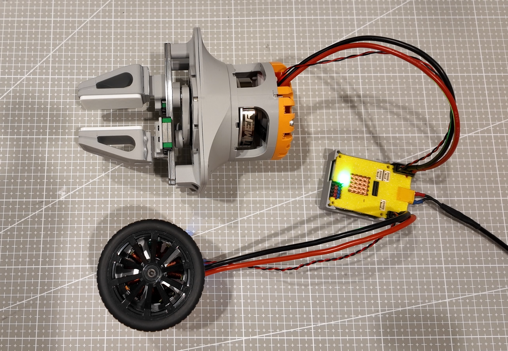

# Open-Gripper-Plus

An open robotic gripper built around a cycloidal gear actuator, dual ODrive motor control, and an STM32H723 control board.



## Overview

Open-Gripper-Plus combines a compact mechanical gripper with embedded control electronics for synchronized actuator operation. The repository includes the mechanical CAD files and the STM32 firmware project used to communicate with the motor controllers.

## Features

- Cycloidal gear actuator and custom gripper parts
- STM32H723VGT6 control board
- Dual FDCAN interfaces for ODrive communication
- BMI088 accelerometer and gyroscope support over SPI
- 1 kHz control loop with position synchronization and torque limits
- UART logging and WS2812 status LEDs

## Repository Layout

```text
3D Model/
	5010+Cycloidal+Gear+Actuator/  Reference actuator CAD
	modified part/                 Custom gripper and actuator parts
Images/                          Project images
STM32-H723/                      STM32CubeIDE firmware project
```

## Firmware

The firmware project is located in [`STM32-H723/`](STM32-H723/). The CubeMX configuration is [`vla-arm.ioc`](STM32-H723/vla-arm.ioc), and the application entry point is [`main.c`](STM32-H723/Core/Src/main.c).

The controller assigns two motor nodes to the leader and follower axes and exchanges motor state over FDCAN. Control parameters such as spring gain, damping, follow ratio, deadband, and torque limits are defined near the top of `main.c`.

### Build

Open [`STM32-H723/vla-arm.ioc`](STM32-H723/vla-arm.ioc) or the project in STM32CubeIDE, select the `Debug` or `Release` configuration, and build for the STM32H723VGT6 target. The generated build output is placed in the corresponding `STM32-H723/Debug/` or `STM32-H723/Release/` directory.

Before powering the actuator, verify the motor node IDs, CAN wiring, motor enable wiring, torque limits, and mechanical travel for your hardware.

## Mechanical Files

The `3D Model/modified part/` directory contains the custom STEP parts:

- `motor-base.step`
- `part-1.step` through `part-6.step`

The `3D Model/5010+Cycloidal+Gear+Actuator/` directory contains the reference actuator model.

## License

This project is released under the [MIT License](LICENSE).
